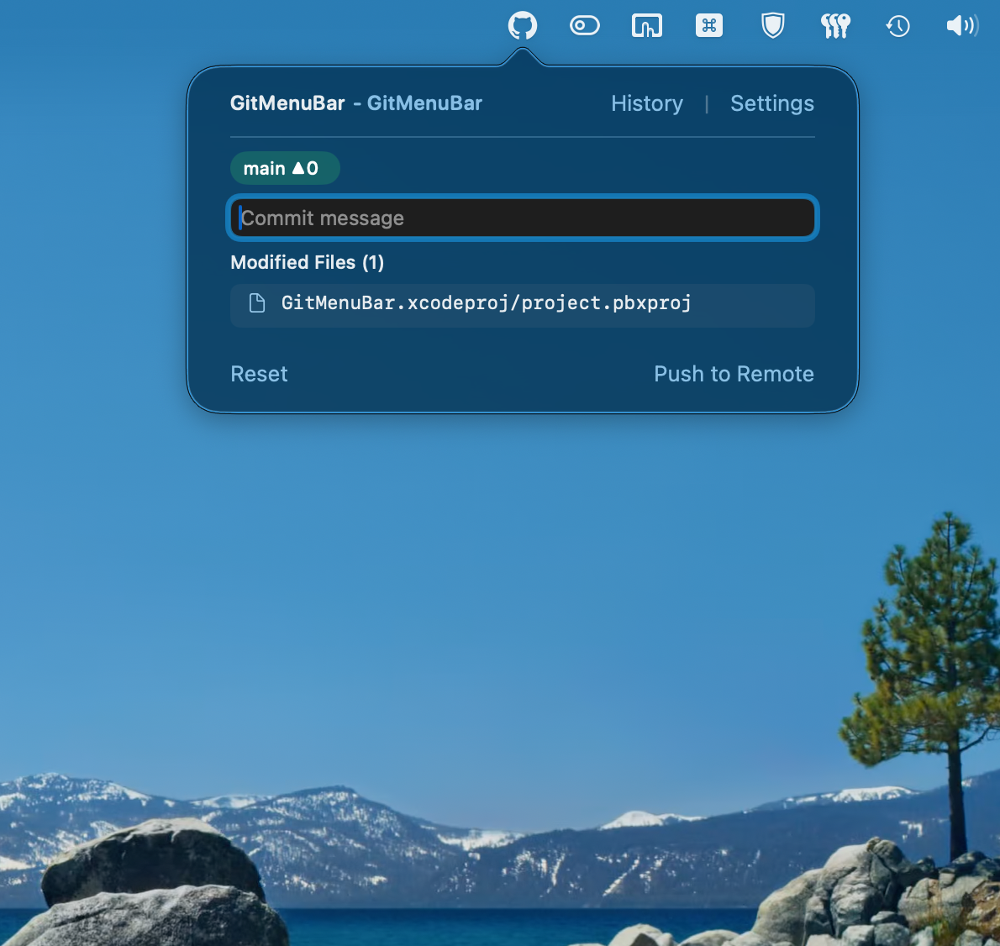
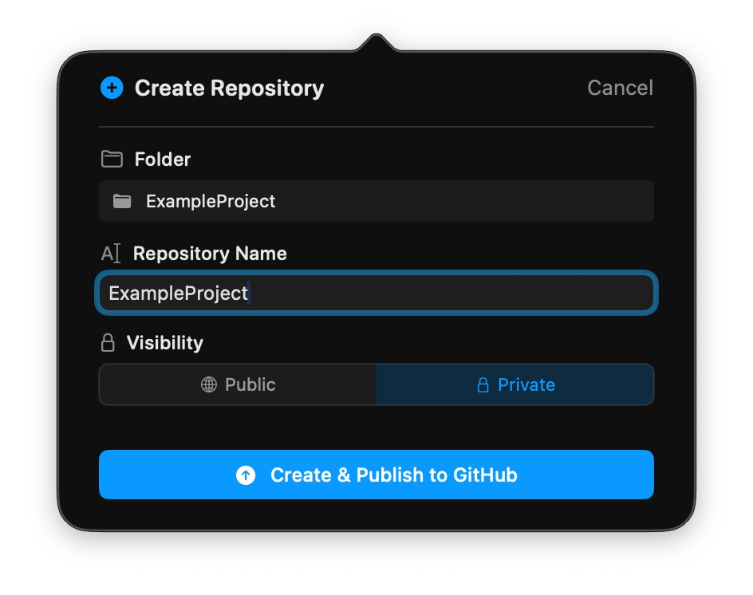
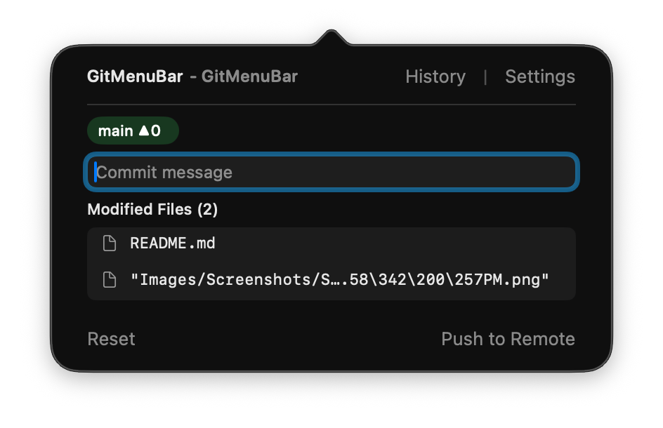
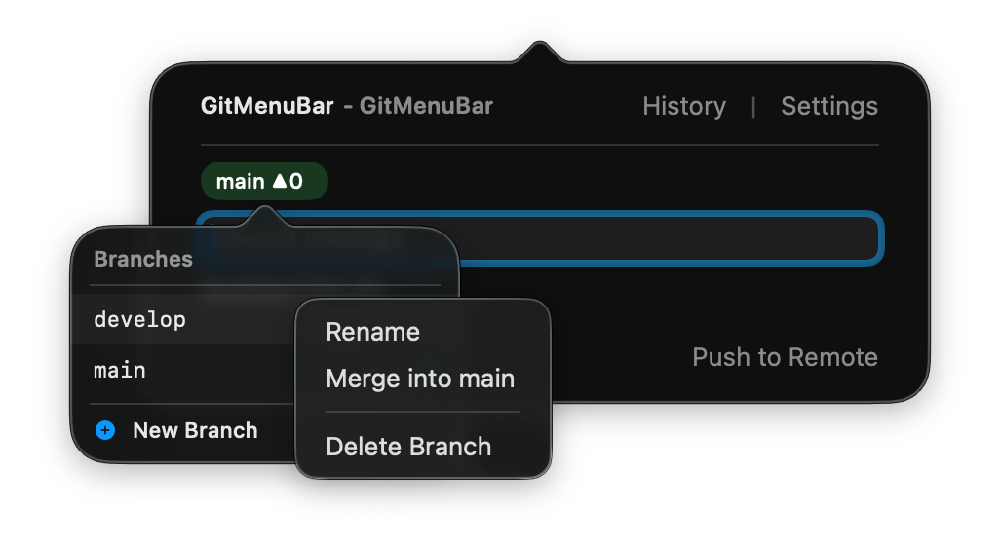
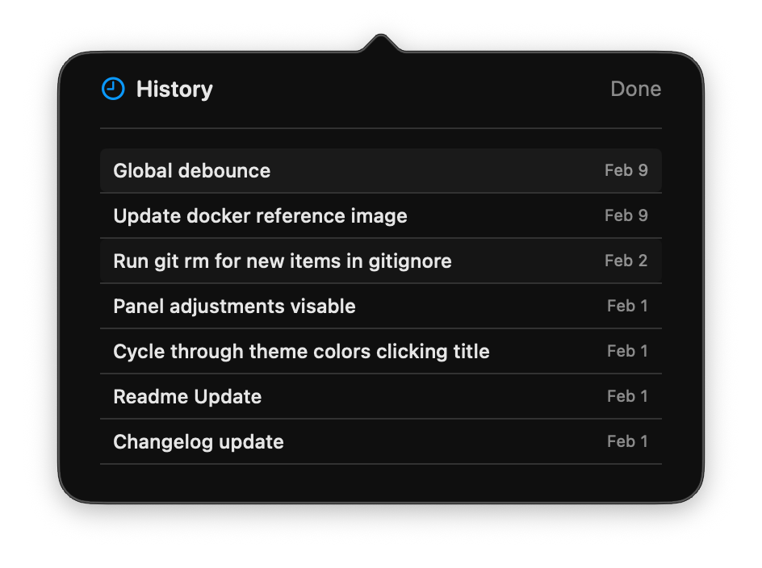
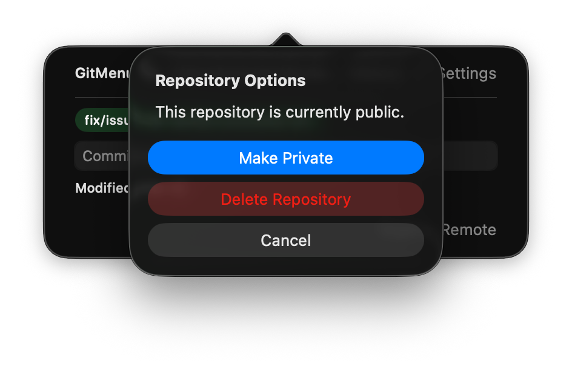
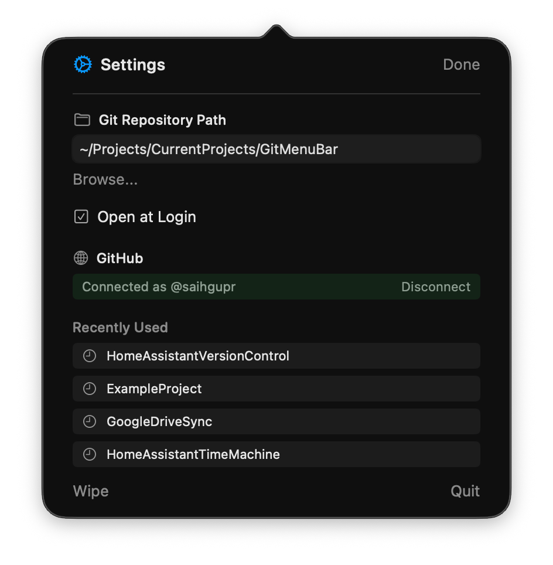

<h1>
  GitMenuBar
  
</h1>

**A native macOS menu bar app for simple, fast Git workflows**

GitMenuBar brings essential Git operations to your Mac the way they should be. Simple, efficient, and living right in your menu bar. No complex setup, no terminal wrestling, just manage your code and keep moving.

<p align="center">
  
</p>

## Why GitMenuBar?

### Lightweight and Efficient
GitMenuBar operates entirely from the macOS menu bar, staying out of the dock and avoiding full-window clutter. It is highly efficient, using minimal system resources and occupying only about 5.2 MB of storage.

### Speed Over Complexity
Actions that usually require navigating GitHub settings, like creating new repositories, toggling between public and private visibility, or deleting repositories entirely, are now instantaneous button presses.

### Built for Focus
Designed for developers who want to stay focused on their work without managing terminal commands or navigating large Git client interfaces. It removes unnecessary interface complexity and surfaces only the actions most developers need during active work.

### Safety First
The application emphasizes safe workflows by clearly explaining actions and providing protective prompts when changes could lead to data loss. For operations like Wipe, it even creates automatic `.git` backups before proceeding.


## Features

- **Instant Repository Management**: Create, delete, and toggle visibility of GitHub repositories with a single click - no web browser required.
- **Streamlined Workflow**: View modified, staged, and untracked files and commit directly from your menu bar.
- **One-Step Sync**: Commit and push in a single action using `⌘Enter`.
- **Flexible Pulling & Rebasing**: When your local branch is behind, syncing gives you the choice to merge, rebase, or pull changes to a fresh branch.
- **Smart Branching**: Switch, create, and merge branches with automatic handling of uncommitted changes.
- **History & Recovery**: Browse full commit history and reset to any previous state easily.
- **Wipe & Restart**: Perfect for project templates. Resets repository history while preserving current files, with automatic safety backups.
- **Native Experience**: A lightweight (5.2 MB) Swift app that lives in your menu bar and stays out of your way.

<p align="center">
  
  
  
</p>

<p align="center">
  
  
  
</p>

## Requirements 

- macOS 13.0 or later
- Git installed on your system
- GitHub account (optional, for remote features)

## Installation

### Option 1: Download (Recommended)
Grab the latest version from the [Releases page](https://github.com/saihgupr/GitMenuBar/releases). Just download, drag to Applications, and launch.

### Option 2: Build from Source
1. Clone this repo
2. Open `GitMenuBar.xcodeproj` in Xcode
3. Hit `⌘R` to build and run

## Getting Started

### 1. Select a Repository
Click the icon in your menu bar, open **Settings** → **Choose Repository**. GitMenuBar automatically detects existing repositories or offers to initialize non-Git folders.

### 2. Connect GitHub (Optional)
To enable push/pull and repository management, go to **Settings** → **Connect GitHub** and follow the simple authorization flow.

## Using GitMenuBar

**Committing**: Type your message in the main view. Press `Enter` to commit locally, or `⌘Enter` to commit and push immediately.

**Branching**: Click the branch name to open the Branch Menu. From here you can switch, create, or right-click branches to rename, merge, or delete them.

**Navigation**: Click the repository name at the top to open it on GitHub, or `⌘Click` to reveal the local folder in Finder.

**Maintenance**: Long-press the repository name at the top of the menu to toggle Public/Private visibility or delete the repository from GitHub.

**Resetting**: Use the **Reset** button in the main view to discard local changes, or **Wipe** in Settings for a fresh start with a clean history.

**Command Line Tip**: You can quickly open any folder in GitMenuBar from your terminal using:
```bash
open -a "GitMenuBar" "/path/to/your/folder"
```

## Support & Feedback

If you run into trouble or have an idea, please [open an issue](https://github.com/saihgupr/GitMenuBar/issues) on GitHub.

GitMenuBar is **open-source** and **free**. If you find it useful, consider giving it a star ⭐ or making a [donation](https://ko-fi.com/saihgupr) to support development.

---

[MIT License](LICENSE) © 2026 Saihgupr