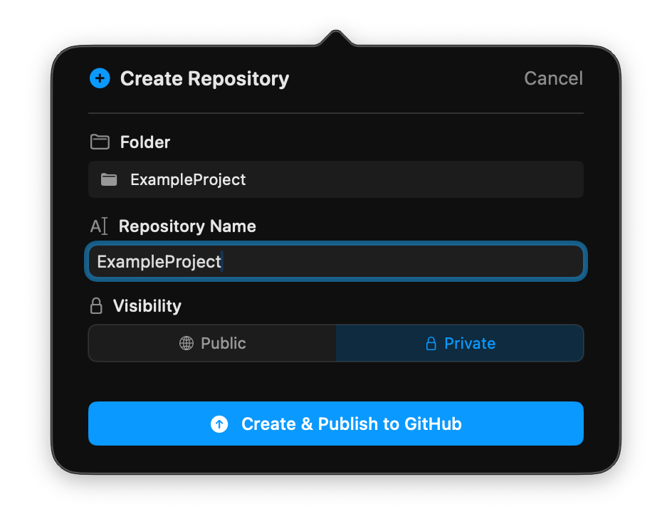
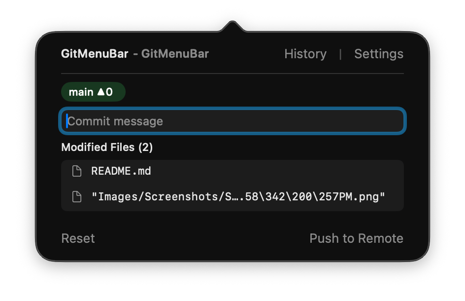
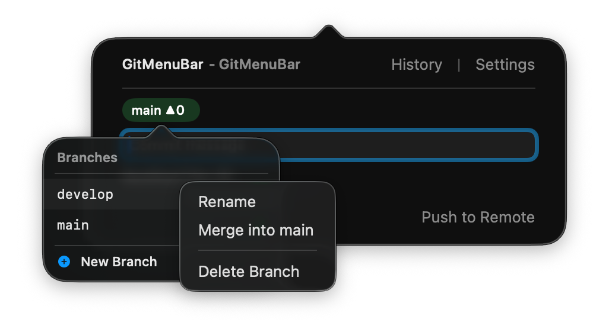
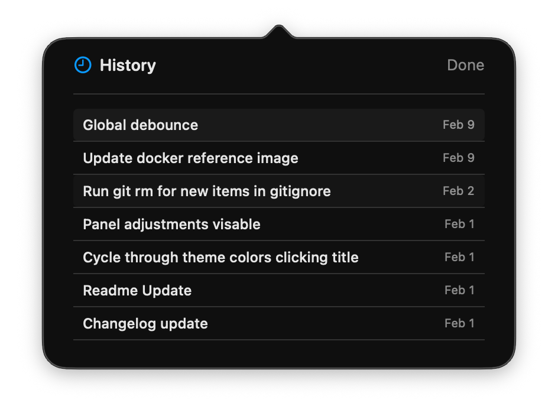
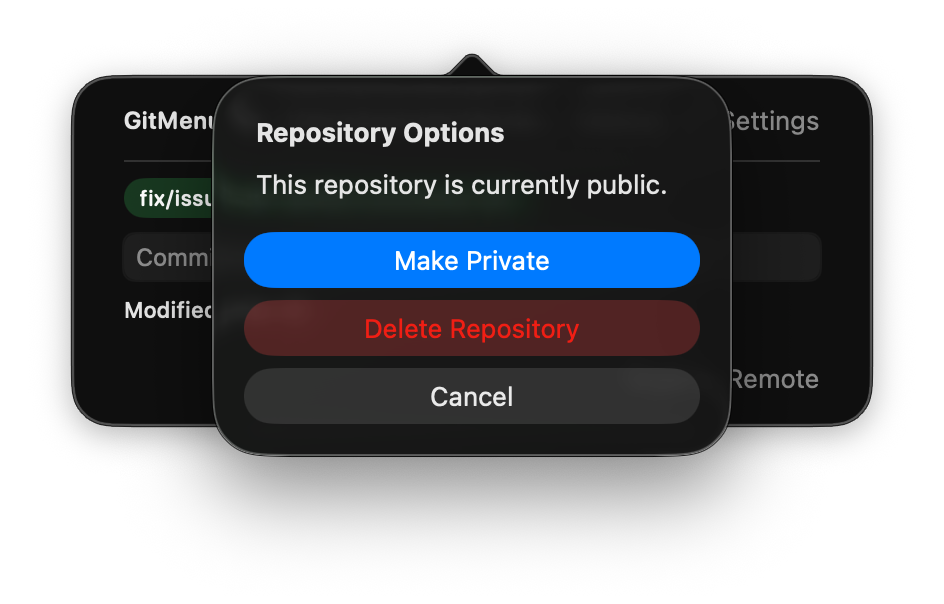
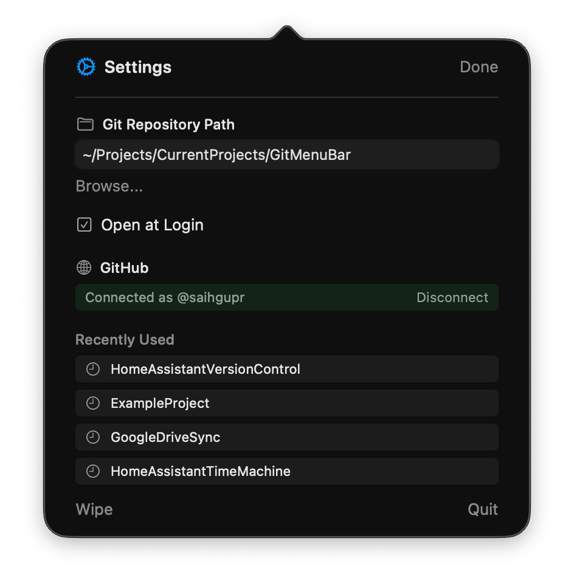

<h1>
  GitMenuBar
  
</h1>

**A native macOS workbench for everyday Git workflows**

GitMenuBar is a local-first Git companion that lives in the macOS menu bar and
opens a focused workbench when you need it. Inspect repository state, review
changes, create commits, sync with remotes, manage branches and worktrees, and
keep an eye on several projects without switching to a full-size Git client.

<p align="center">
  
</p>

## About this fork

GitMenuBar started as a fork of [saihgupr/GitMenuBar](https://github.com/saihgupr/GitMenuBar). Since then, its codebase, interface, and product direction have diverged substantially. This repository is now an independent app with its own workflow, architecture, and feature set—not a drop-in continuation of the original project.

## Why GitMenuBar?

### Local-first

The main workflow is built around the local repository: inspect the working
tree, review diffs, prepare a commit, and decide when to publish it. GitHub and
AI features are optional integrations rather than requirements for everyday use.

### Focused and native

GitMenuBar is a Swift macOS app designed for quick access from the menu bar. It
keeps Git work close at hand without requiring a terminal or a heavyweight
repository window.

### Safe by default

Operations that can rewrite history, discard changes, delete branches, or
remove worktrees are explicit and reviewed before they run. The app keeps
full Git control available while making the consequences visible.

## Features

- **Project workbench**: Add, switch, rename, and monitor multiple local repositories from one window.
- **Working tree review**: Inspect staged, unstaged, and untracked files with status-aware diffs and file actions.
- **Commit workflow**: Commit locally or commit and push, with configurable button behavior and keyboard shortcuts.
- **AI-assisted commits**: Generate or rewrite commit messages and optionally split changes into reviewable atomic commits using a configured AI provider.
- **Branches and worktrees**: Create, switch, rename, merge, push, and delete branches; inspect linked worktrees and clean up safely merged local work.
- **Remote sync**: Push and pull changes, choose merge or rebase when syncing, or pull changes into a new branch.
- **History and recovery**: Browse grouped commit history, inspect changed files, edit commit messages, and reset to a selected commit when needed.
- **GitHub integration**: Authenticate with GitHub to create repositories, change visibility, delete repositories, and work with remote operations without leaving the app.
- **Command palette**: Search and run project, Git, branch, history, and settings actions from the keyboard.
- **Companion CLI**: Install `gitmenubar` on your `PATH` for non-interactive AI-assisted commit proposals and controlled commit application.

<p align="center">
  
  
  
</p>

<p align="center">
  
  
  
</p>

## Requirements

- macOS 15.5 or later
- Git installed on your system
- A GitHub account, only if you want GitHub features
- An AI provider and API key, only if you want AI-assisted commit features

To build from source, use Xcode 27 or later.

## Installation

### Option 1: Download

Download the latest release from the [Releases page](https://github.com/mourato/GitMenuBar/releases), move GitMenuBar to `/Applications`, and launch it.

### Option 2: Build from source

1. Clone this repository.
2. Open `GitMenuBar.xcodeproj` in Xcode.
3. Press `⌘R` to build and run.

For the CLI-first workflow:

```bash
make build
```

To build and install a Release app interactively:

```bash
make install-app
```

The repository also provides `make build-release`, `make test`, `make lint`,
and `make install-cli` for local development and verification.

## Getting Started

1. **Add a project**: Open GitMenuBar and choose a local repository folder. Add other repositories from the Projects sidebar when you want to monitor them too.
2. **Review the workbench**: Select a project to inspect its branch, working tree, history, and remote status.
3. **Choose your integrations**: Connect GitHub in Settings for remote repository features. Configure an AI provider in Settings → AI when you want generated commit messages or atomic commits.

## Using GitMenuBar

**Committing**: Enter a message in the commit composer, or let a configured AI
provider generate one. Settings lets you choose between committing locally and
committing with an immediate push.

**Branching and worktrees**: Use the branch controls to switch, create, rename,
merge, push, or delete branches. The worktree view shows linked checkouts and
offers safe cleanup for eligible merged branches.

**Syncing**: Use Sync to pull or push remote changes. When the local and remote
branches have diverged, GitMenuBar lets you choose the appropriate strategy.

**Navigation**: Open the command palette to search available actions, or use
the repository controls to reveal the local folder in Finder and open the
remote repository when one is configured.

**Discarding and resetting**: File-level discard, discard-all, branch cleanup,
and history reset are destructive operations and require explicit confirmation.

**Command line**: Open any folder in GitMenuBar from Terminal with:

```bash
open -a "GitMenuBar" "/path/to/your/folder"
```

## Support and feedback

If you find a bug or have an idea, [open an issue](https://github.com/mourato/GitMenuBar/issues). Contributions and focused feedback are welcome.

GitMenuBar is open-source and free to use. If it helps your workflow, consider
giving this repository a star.

## Credits and third-party notices

Some GitMenuBar implementation details are adapted from open-source projects:

- [Mimir](https://github.com/erayendes/mimir) — MIT, Copyright (c) 2026 Eray Endes; Codex usage parsing.
- [CodexBar](https://github.com/steipete/CodexBar) — MIT, Copyright (c) 2026 Peter Steinberger; OpenRouter credits parsing and provider icons.
- [`@pierre/trees`](https://www.npmjs.com/package/@pierre/trees) — Apache-2.0, with the retained `headless-tree/core` MIT notice; curated file-type SVG paths.

See [THIRD-PARTY-NOTICES.md](THIRD-PARTY-NOTICES.md) and
[`GitMenuBar/Resources/FileTypeIcons/NOTICE.md`](GitMenuBar/Resources/FileTypeIcons/NOTICE.md)
for the applicable notices. T3Code is a UI reference only; its source is not
copied into GitMenuBar.
